# EvoFuse

Jinyuan Liu, Bowei Zhang, Ludan Sun, Xingyuan Li, Long Ma, Risheng Liu, Xin Fan, **"Symbiotic Evolutionary Learning for Task-Adaptive Infrared and Visible Image Fusion"**,
IEEE Transactions on Pattern Analysis and Machine Intelligence **(TPAMI)**, 2026.

[[Paper](https://doi.org/10.1109/TPAMI.2026.3722665)]

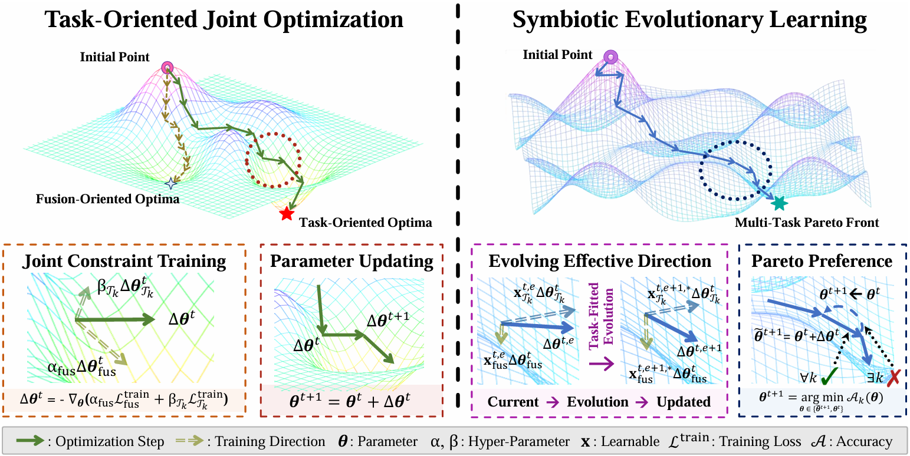


## Updates

[2026-08-10] Our paper is available online in IEEE Transactions on Pattern Analysis and Machine Intelligence! [[Paper](https://doi.org/10.1109/TPAMI.2026.3722665)]  
[2026-08-29] 中译版本已更新! [[中译版本](./pdf/EvoFuse_CN.pdf)]   

## Introduction

We propose **EvoFuse**, a symbiotic evolutionary learning framework for task-adaptive infrared and visible image fusion. EvoFuse formulates fusion and downstream perception as a multi-objective optimization problem and dynamically evolves task-aware loss-weight configurations under a Pareto-inspired non-degradation criterion. A diverse reweight architecture provides multi-branch representation capacity during training and can be re-parameterized into an ultra-compact single-branch model for efficient inference. In addition, a saliency discriminative loss emphasizes semantically important regions and improves the utility of fused images for heterogeneous downstream tasks.


## Environment

```bash
# create virtual environment
conda create -n evofuse python=3.10 -y
conda activate evofuse
python -m pip install torch==2.1.0 torchvision==0.16.0 torchaudio==2.1.0

# install requirements
pip install --no-deps -r requirements.txt
```


## Datasets Preparation

We provide demo datasets for image fusion in **"EvoFuse/FusionDatasets"**, as well as demo datasets for downstream tasks in **"EvoFuse/datasets"**.
Please organize all datasets as the given dataset demo. Infrared and visible images must be paired using identical filenames.

```text
EvoFuse/
├── datasets/
│   ├── M3FD/
│   │   ├── train/
│   │   │   ├── irimages/           # Infrared training images
│   │   │   ├── viimages/           # Visible training images
│   │   │   ├── images/             # Generated fusion images
│   │   │   └── labels/             # Object detection annotations
│   │   └── val/
│   │       ├── irimages/
│   │       ├── viimages/
│   │       ├── images/
│   │       └── labels/
│   ├── FMB/
│   ├── MFNet/
│   ├── MSOD/
│   ├── VT821/
│   ├── VT1000/
│   ├── VT5000/
│   ├── Potsdam/
│   └── WHU/
├── FusionDatasets/
│   ├── M3FD/
│   │   ├── ir/
│   │   ├── vi/
│   ├── TNO/
│   ├── RoadScene/
│   ├── FMB/
└── EvoFuseRuns/                    # Default training work folder for EvoFuse, which can be modified in EvoFuse/evo_path_config/paths.py
    ├── fusion_model/            # EvoFuse evolutionary checkpoints
    ├── object_detection/
    ├── semantic_segmentation/
    ├── salient_object_detection/
    ├── remote_sensing/
```

For example, a paired infrared-visible sample should be organized as follows:

```text
datasets/M3FD/train/infrared/00001.png
datasets/M3FD/train/visible/00001.png
datasets/M3FD/train/labels/00001.txt
```

The supported datasets are grouped by task as follows:

| Task | Datasets |
| --- | --- |
| Image fusion | TNO, RoadScene, FMB, M3FD |
| Semantic segmentation | FMB, MFNet |
| Salient object detection | VT821, VT1000, VT5000 |
| Multiclass object detection | M3FD, MSOD |
| Remote sensing segmentation | Potsdam, WHU |

We test image fusion according to full datasets in the [[IVIF ZOO Project](https://github.com/RollingPlain/IVIF_ZOO/)].  
Training datasets for downstream tasks are available in [[BaiduNetdisk](https://pan.baidu.com/s/13lVNSMD9eToLxF3_8k3IOA?pwd=evof)] or [[Google Drive](https://drive.google.com/drive/folders/1iFKsKatCqofVkj9mgw4ph8mEesxzLneL?usp=sharing)].  


## Test Image Fusion

Our checkpoints can be found in **"EvoFuse/ckpt"**. Then, you can test our fusion method through

```bash
python test_Fusion.py
```


## Train EvoFuse

You can train our EvoFuse method through

```bash
python main.py
```

In ```main.py```, you can also use this unified code to **generate multiple dataset images**, **train downstream tasks for a model**, and **test the metrics of a fusion model on multiple downstream tasks**.


## Fusion Results

1. Quantitative comparison of EvoFuse and state-of-the-art infrared and visible image fusion methods on the TNO, RoadScene, FMB, and M3FD datasets.

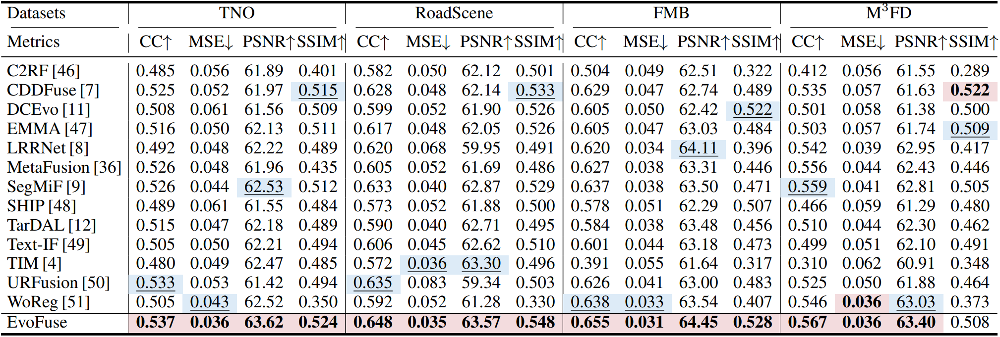

2. Qualitative comparison of EvoFuse and existing image fusion methods on the TNO, RoadScene, and M3FD datasets.

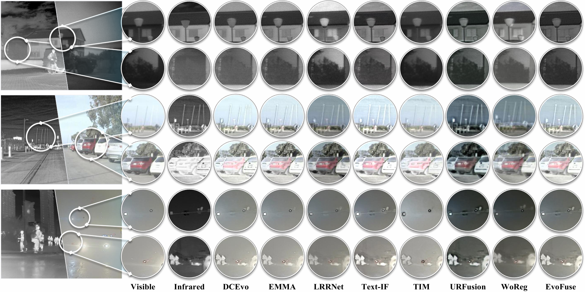


## Results of Task-Adaptive Downstream IVIF Applications

### Image Semantic Segmentation

1. Quantitative comparison on the FMB and MFNet datasets.

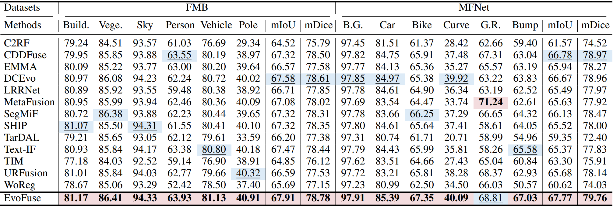

2. Qualitative comparison on the FMB and MFNet datasets.

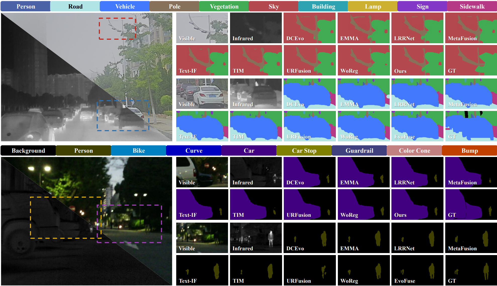


### Salient Object Detection

1. Quantitative comparison on the VT821, VT1000, and VT5000 datasets.

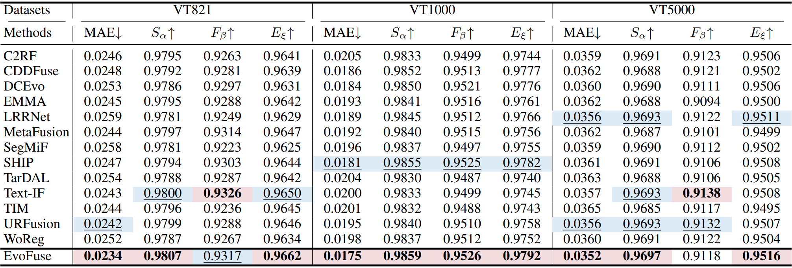

2. Qualitative comparison on the VT821, VT1000, and VT5000 datasets.

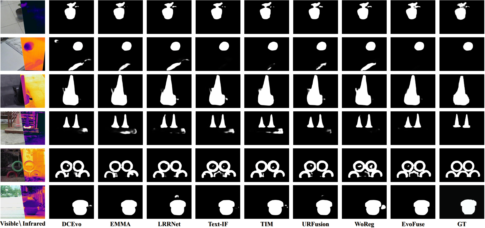


### Multiclass Object Detection

1. Quantitative comparison on the M3FD and MSOD datasets.

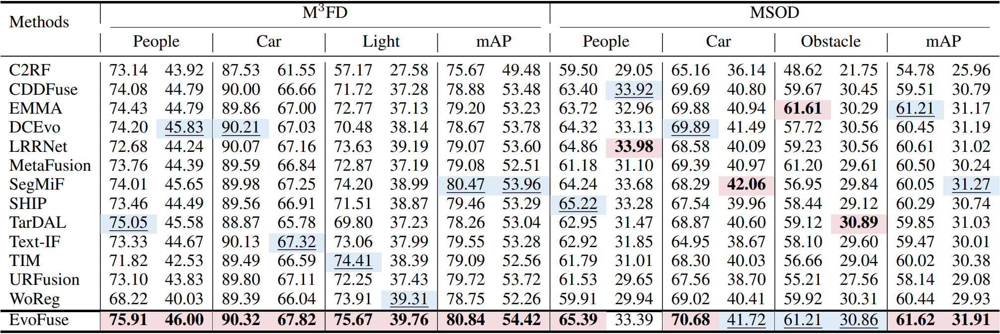

2. Qualitative comparison on the M3FD and MSOD datasets.

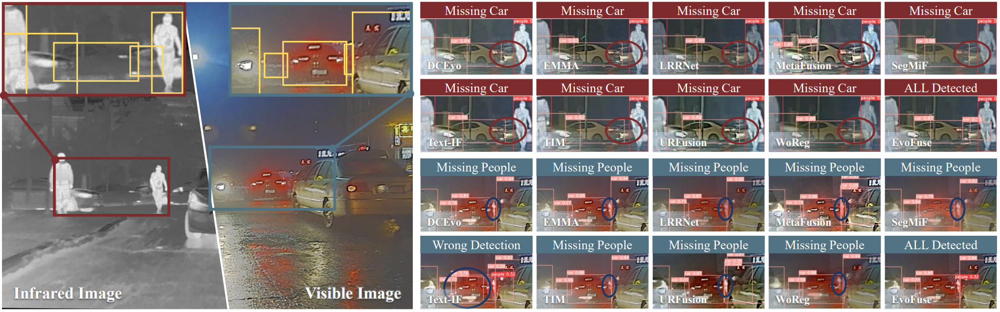


### Remote Sensing Semantic Segmentation

1. Quantitative comparison on the WHU and Potsdam datasets.

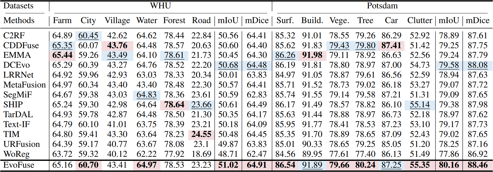

2. Qualitative comparison on the Potsdam and WHU datasets.

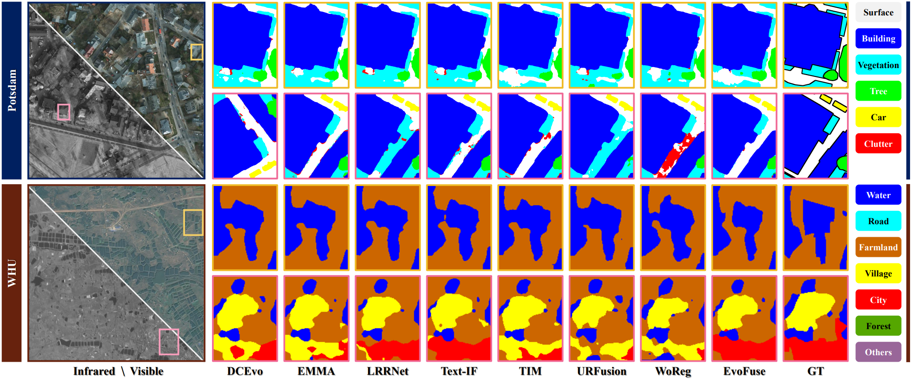


## Complexity Analysis

EvoFuse achieves a favorable balance between inference efficiency and perceptual adaptability with a compact re-parameterized fusion network.

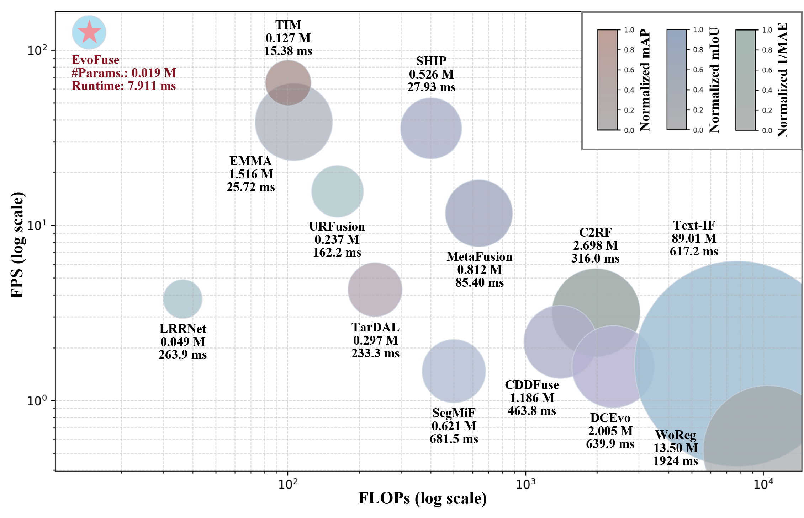


## Citation

```bibtex
@ARTICLE{Liu_2026_TPAMI,
    author  = {Liu, Jinyuan and Zhang, Bowei and Sun, Ludan and Li, Xingyuan and Ma, Long and Liu, Risheng and Fan, Xin},
    title   = {Symbiotic Evolutionary Learning for Task-Adaptive Infrared and Visible Image Fusion},
    journal = {IEEE Transactions on Pattern Analysis and Machine Intelligence},
    year    = {2026},
    pages   = {1--18},
    doi     = {10.1109/TPAMI.2026.3722665}
}
```
